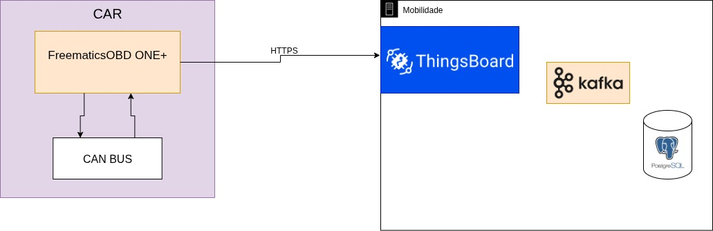
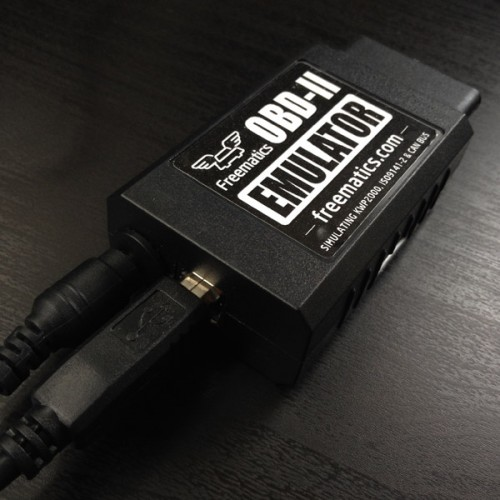
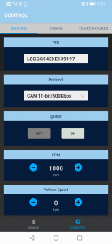
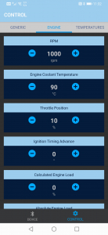
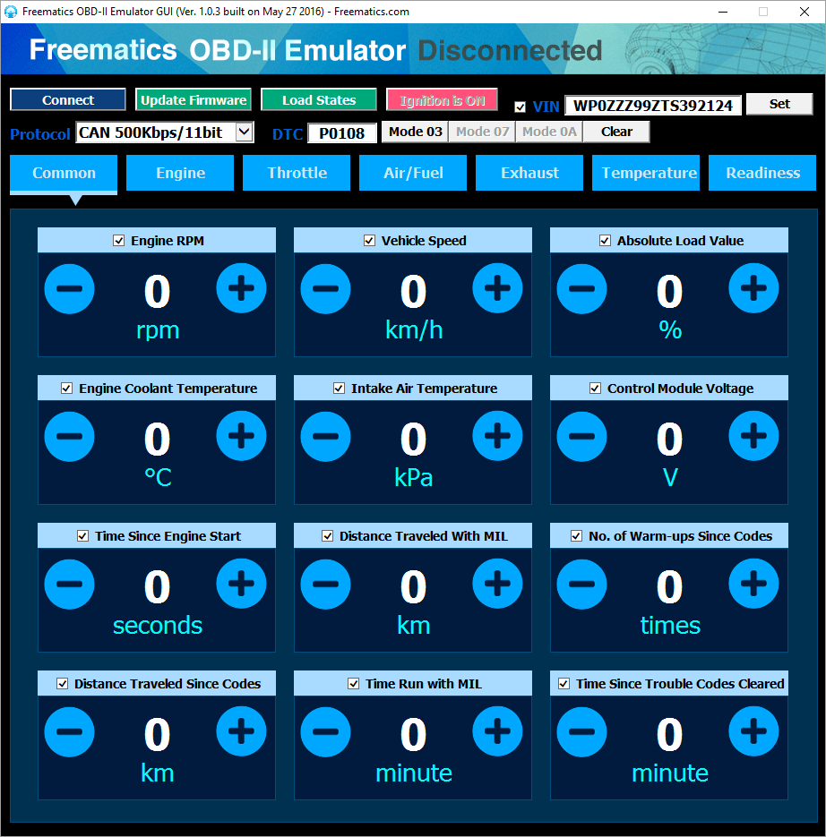
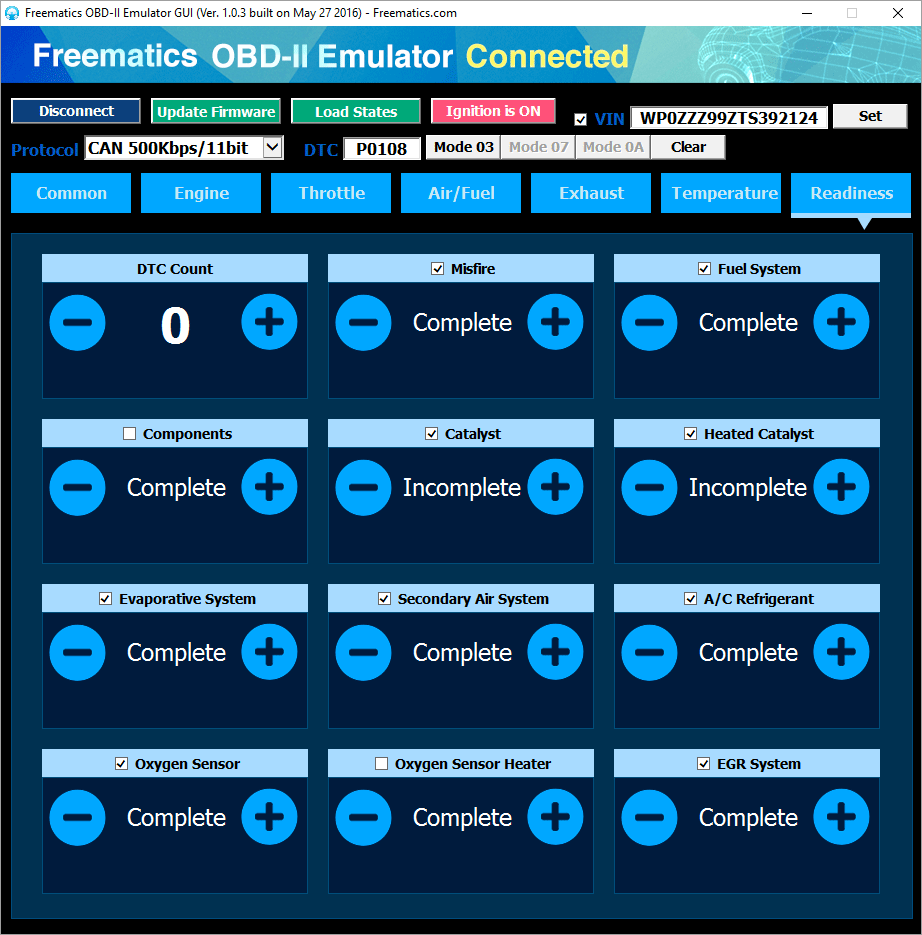

# Freematics OBD
<!--
## 1. Qual o propósito do projeto?
    Esse projeto tem por objetivo a coleta, e o envio de dados veiculares para a plataforma do ThingsBoard no servidor do Inmetro, utilizando o dispositivo Freematics OBD. A plataforma vai ser responsável pelo armazenamento dos dados veículares.

## 2. Como funciona?
    O Freematics OBD será responsável pela leitura da rede CAN dos veículos, no qual vai realizar a coleta e o envio dos dados obtidos. Os dados seram armazenados em uma plataforma ospedada no servidor do Inmetro, e para realizar essa comunicação entre o dispositivo e a plataforma, é necessário utilizar um token obtido pela própria plataforma e criar um CA x509 para uma comunicação segura com HTTPS.

## 3. Quais versões do Freematics o código foi testado?
    O código foi escrito e testado na versão 1.1 da biblioteca FreematicsPlus.

## 4. Como que o dispositivo está enviado dados pro Thingsboard? (HTTP, Websocket, ...)
    A comunicação entre o dispositivo e a plataforma é relizada através do protocolo HTTPS, utlizando um CA x509 para uma comunicação segura e criptografada.

## 5. Qual conectividade o Freematics está usando (Wifi, 5G, Bluetooth...)?
    O dispositivo se comunica através da rede WiFi.

## 6. Qual nível de segurança do projeto (usa SSL/TLS, criptografa os dados enviados, assina os dados enviados)?
    O prejeto conta com o uso de SSL/TLS para garantir uma comunicação segura entre o dispositivo e a plataforma.

7. Se não tem mecanismos de segurança é possível habilitar? (Aqui pode explicar o que é possível fazer, mas pode apontar a documentação do Thingsboard, por exemplo). 

8. Qual a arquitetura está sendo utilizada (cliente/sevidor, pub/sub)?
    O projeto utiliza a arquitetura cliente/servidor, 
Você pode colocar um diagrama pra explicar como as coisas se conectam. Carro >> Freematics >> Thingsboard >> Banco de dados 
-->

<!-- #### Resumo sobre o projeto -->
#### Propósito do Projeto

<!-- <p>Esse é um código voltado para a coleta e o envio de telemetria do Freematics OBD, para a plataforma do <a href="https://mobilidade.inmetro.gov.br/login">thingsboard</a> no servidor do Inmetro.</p> -->

Esse projeto tem por objetivo a coleta, e o envio de dados veiculares para a plataforma do ThingsBoard no servidor do Inmetro, utilizando o dispositivo FreematicsOBD ONE+, através de uma comunicação WiFi. A plataforma vai ser responsável por receber e armazenar os dos dados veículares.

- Como funciona:
    > O Freematics OBD será responsável pela leitura da rede CAN dos veículos, no qual vai realizar a coleta e o envio dos dados obtidos. O projeto utiliza a arquitetura cliente/servidor, para enviar os dados via HTTPS. As informações são armazenados em uma plataforma ospedada no servidor do Inmetro, e para realizar essa comunicação, é necessário utilizar um token obtido pela própria plataforma e criar um CA x509 para garantir uma comunicação segura.

- Nível de Segurança:
    >  O prejeto conta com o uso de SSL/TLS para garantir uma comunicação segura entre o dispositivo e a plataforma. O dispositivo utliza um CA x509 para garantir a segurança durante a comunicação.



<!-- <a href="./docs/DOCS.md">Documentação detalhada sobre as funcionalidades do código.</a> -->
----------------
#### Guia simples:
<!-- Para compilar o código e embarcar no Freematics OBD, é necessário instalar o <a href="https://docs.platformio.org/en/latest/what-is-platformio.html">Platformio</a>, e algumas dependências extras. -->

Esse é um guia para realizar as configurações básicas do dispositivo.

Para compilar o código e embarcar no Freematics OBD, é necessário instalar o Platformio, no VSCode. A extenção vai realizar todas as configurações automaticamente com base no arquivo "<ins>platformio.ini</ins>" presente na raiz do projeto.

Para que a extenção do Platformio funcione corretamente, abra no VSCode a pasta aonde se encontra o arquivo <ins>platformiol.ini</ins>, no qual contém todas as configurações e orientações para o compilador ser iniciado corretamente.

link da documentação para utlizar o platformio no VSCode: https://docs.platformio.org/en/latest/integration/ide/vscode.html

<!-- #### **python requiriments**
-------------------------

Guia de instalação do Platformio e outras dependências em um ambiente virtual em python

```sh
python3 -m venv .venv

#linux
source .venv/bin/active
#windows
.\.venv\Scripts\Activate.ps1

python3 -m pip install -U esptool platformio
``` -->
<!-- #### **Compilando o código**
---------------------

Guia de comandos do Platformio para compilar, limpar, monitorar e instalar novas bibliotecas se necessário. Todos esses comandos devem ser execudados no mesmo diretório em que se encontra o "platformio.ini".

```sh
pio run # compila o código
pio run -t upload # embarca o código
pio run -t clean # limpa dados compilados. Util em caso de erro persistente em código já compilado
pio device monitor -b 115200 # ler dados do dispositivo via serial. O parâmetro -b indica qual a frequência serial do dispositivo, caso o dispositivo utilize outra, mude esse valor para a mesma. Exemplo: pio device monitor -b 9600
pio pkg install ExampleLib@0.0.1 # baixa uma biblioteca com versão específica. Exemplo: pio pkg install Thingsboard@0.15.0
pio pkg uninstall ExampleLib@0.0.1 # remove uma biblioteca em específico. Exmplo: pio pkg uninstall Thingsboard@0.15.0
pio pkg list # lista bibliotecas baixadas localmente
``` -->
<!--
--------------------
#### **platformio.ini**

Arquivo de configuração do compilador para Freematics OBD, contendo todas as configurações do dispositivo, depêndencias de bibiliotecas, e informações para o compilador.

--------------------
#### **Configurações iniciais**
-->
**Configuração de credenciais para o dispositivo:** 

```c
// WiFi credentials
constexpr char WIFI_SSID[] = "WebTeste"; // Nome da rede WiFi
constexpr char WIFI_PASSWORD[] = "123123123"; // Senha da rede WiFi

// ThingsBoard config
constexpr char TOKEN[] = "tokentoken"; // Token Obtido na plataforma do ThingsBoard
/* Para o link do site, utilize apenas o nome do site como 'site.com', as extenção de HTTP, HTTPS ou preparações para MQTT são tratados pela biblioteca do ThingsBoard.*/
constexpr char THINGSBOARD_SERVER[] = "site.com"; // link do servidor aonde o ThingsBoard está ospedado

// Configurações da comunicação:
#define USING_HTTPS true // Habilita a comunicação HTTP, mas para usar o HTTPS precisa ativar o ENCRYPTED e fornecer o certificado
#define ENCRYPTED true // Habilita a comunicação cripotografada TSL/SSL com x509. Serve para comunicação HTTPS e MQTT

// Caso utilize uma comunicação criptografada, insira o certificado x509, esse certificado server para a comunicação  criptografada com TSL/SSL. exemplo: https://site.com:443/api/v1/token/telemetry
// Essa configuração deve ser utulizada junto ao token do dispositivo
constexpr char ROOT_CERT[] = R"(-----BEGIN CERTIFICATE-----
|---x509---|
-----END CERTIFICATE-----
)";
```
<!--
```c
// Definem o tamanho limite de uma mensagem. Em alguns cenários quando é necessário receber uma grande quantidade de informações é necessário modificar para um limite superior. Aplicavel ao MQTT
constexpr uint16_t MAX_MESSAGE_SEND_SIZE = 128U; // limite de envio
constexpr uint16_t MAX_MESSAGE_RECEIVE_SIZE = 128U; // limite de recebimento
``` -->
----------------
#### **Bibliotecas**

<!-- Bibliotecas utilizadas no código e suas respectivas versões.  -->
Informações das bibliotecas utilizadas no código.

- ThingsBoard/ThingsBoard@0.15.0
    > Biblioteca responsável pela comunicação entre o dispositivo e o servidor com ThigsBoard, possui suporte para comunicação MQTT, HTTP, HTTPS, MQTT com TSL. A biblioteca utlizada se encontra na versão 0.15.0.

- Freematics/FreematicsPlus@1.1
    > Responsável por gerênciar a comunicação CAN e módulos externos do Freematics como o GPS e o Giroscópio. O dispositivo utilizado é um Freematics ONE +, a biblioteca é preparada para essa versão do dispositivo, como também o suporte para os módulos presentes.
        

<!--
```c
#include <Arduino.h> // Framework Arduino

/* Bibliotecas do Freematics OBD; firmware V5 */
#include <FreematicsPlus.h>    // Biblioteca para o Freematics ONE modelo Plus
#include <FreematicsBase.h> // Classes para determinar alguns modelos de dados prontos, como o GPS.
#include "esp_wifi.h" // corrige erro de dependencias do Freematics em questão de algumas bibliotecas. Essa é uma biblioteca nativa do esp32.

/* Thingsboard@0.15.0 */
// Bibliotecas para o uso de protocolos direfentes.
/* Caso utilize comunicação HTTP */
#include <Arduino_HTTP_Client.h>
#include <ThingsBoardHttp.h>
/* Caso utilize comunicação MQTT */
#include <Arduino_MQTT_Client.h>
#include <ThingsBoard.h>
```
-->

#### **Informações técnicas do Freematics OBD modelo H**

<h5>Detalhes e informações sobre o <a href="https://freematics.com/pages/products/freematics-one-plus-model-h/">modelo H</a></h5>

|	                   |SIM7600E-H                                                                                     | SIM7600A-H                                    |
| :---                 | :---                                                                                          | :---                                          |
| Mobile Network Bands | LTE-TDD B38/B40/B41<br>LTE-FDDB1/B3/B5/B7/B8/B20<br>UMTS/HSPA+ B1/B5/B8<br>GSM/GPRS/EDGEB3/B8 | <p>LTE-FDD B2/B4/B12<br> UMTS/HSPA+ B2/B5</p> |
| Regions              | Europe, Asia, Australia                                                                       | North America (AT&amp;T Certified)            |

|                     | SIM7600E-H & SIM7600A-H |
| :---                | :---                    |
| Data Transfer Speed | LTE CAT4: Uplink up to 50Mbps, Downlink up to 150Mbps<br> HSPA+: Uplink up to 5.76Mbps, Downlink up to 42 Mbps<br> UMTS: Uplink/Downlink up to 384Kbps<br>EDGE: Uplink/Downlink up to 236.8Kbps<br>GPRS: Uplink/Downlink up to 85.6Kbps|


<h5>Comparação entre o modelo H e A</h5>

|                       |     Model H                                            |<a href="https://freematics.com/store/index.php?route=product/product&amp;product_id=85">Model A</a>|
| :---                  |     :---                                               |    :---                                |
| RAM Configuration     | 520KB IRAM + 8MB PSRAM                                 | 520KB IRAM                             |
| Flash Memory          | 16MB           									     | 4MB                                    |
| RTC                   | External 32K                                           | Built-in (less accurate)               |
| Cellular Module       | Integrated 4G LTE CAT4 module                          | Optional cellular module               |
| GNSS                  | Integrated M8030 10Hz GNSS module and antenna          | Via external GNSS receiver             |
| External I/O          | 2x GPIO for digital I/O, analog input, serial UART etc | Occupied if GNSS receiver is connected |
| Co-Processor Features | Vehicle ECU interfacing</br> GNSS data processing      | Vehicle ECU interfacing                |
| Heavy Vehicle Support | HD-OBD connector, 24V system, SAE J1939                | N/A                                    |

<!-- Informações do simulador OBD-II Emulator
	Utilizado em testes de bancada
	colocar links
 -->

#### Freematics OBD Emulator MK2
>Esse dispositivo foi utilizado para realizar testes no Freematics OBD, simulando as funcionalidades de uma rede CAN, enviando dados fictícios. Essas funcionalidade incluem a velocidade, temperatura âmbiente, aceleração etc.
<a href="https://freematics.com/store/index.php?route=product/product&product_id=71">Freematics OBD Emulator MK2</a>


-------

##### Android App

O emulador OBD-II MK2 do Freematics OBD pode ser controlado remotamente via BLE (Bluetooth Low Energy) pelo aplicativo Freematics Controller. Apenas um subconjunto dos recursos da interface gráfica do usuário (GUI) para PC está disponível no aplicativo.
<div>
    
    
    </div>

<!--Esse é um dispositivo que simula informações de rede CAN para o Freematics OBD.-->

-------

##### PC GUI Software
Link de guia para utlizar o Software do Emulador no computador: <a href="https://freematics.com/pages/products/freematics-obd-emulator-mk2/">OBD PC</a>

<div>
    
    
</div>